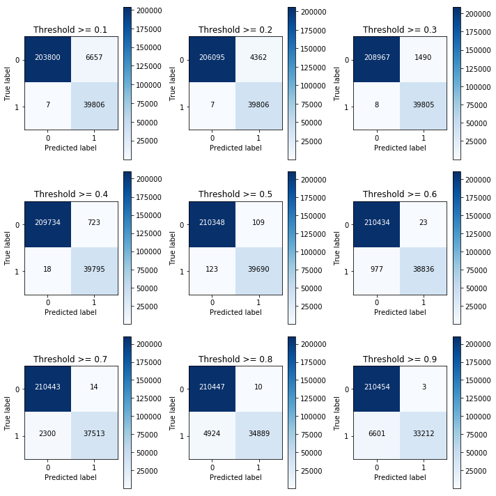
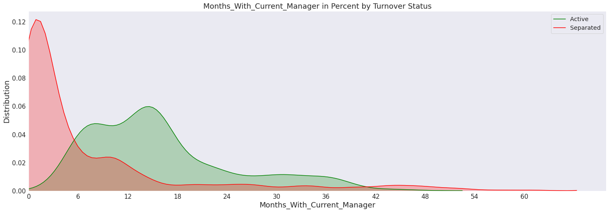
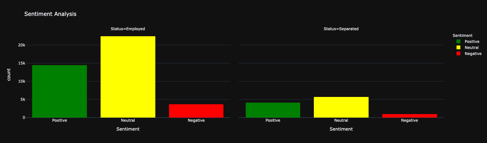
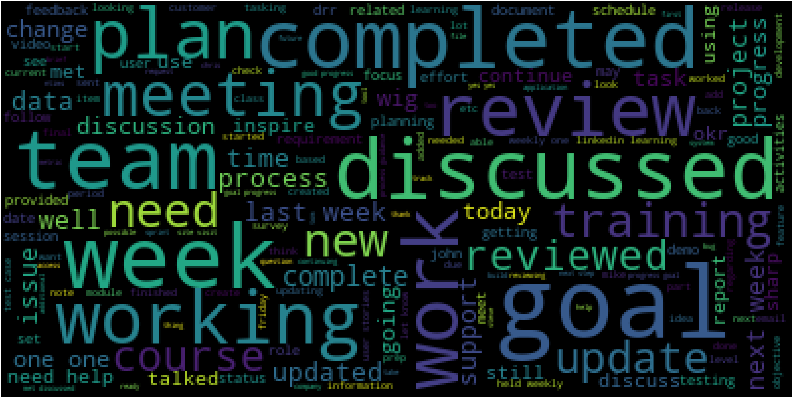
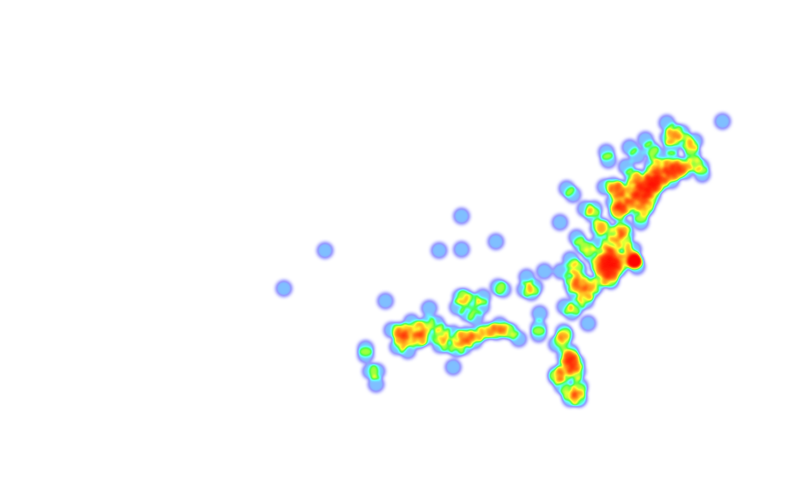
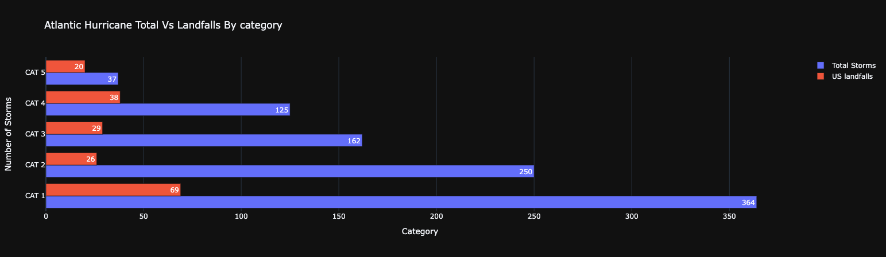
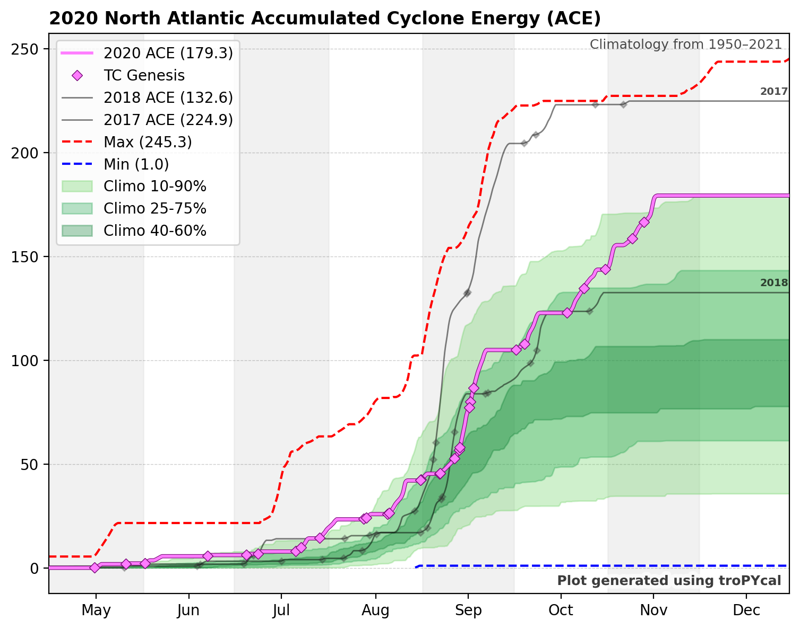
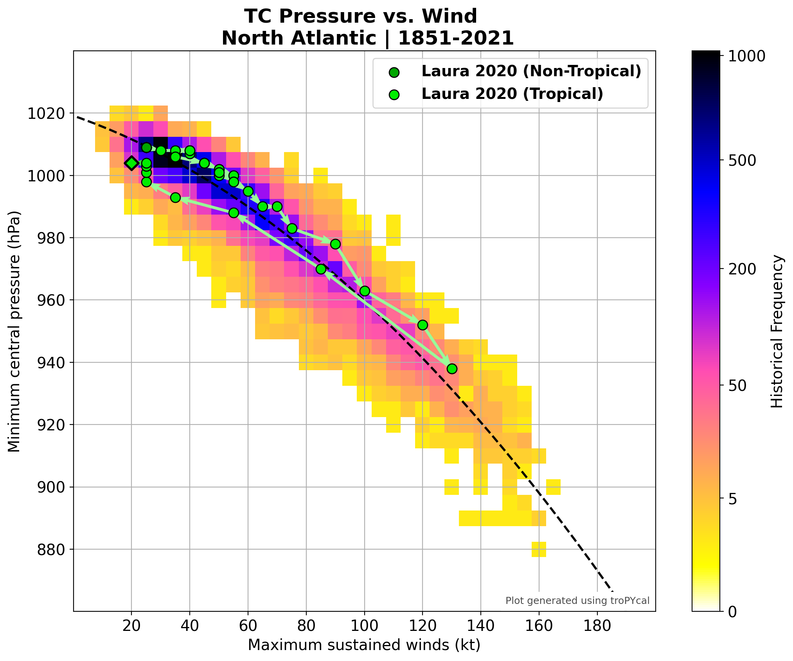

 

# Arpita Parmar

I am a passionate data scientist who has broad and in-depth data engineering, programming, statistics skills.I am using these skills to solve various business problems by using machine learning, data mining, and other types of data analytics and data visualization tools such as Python, Spark, Databricks, Azure suite of data tools, TensorFlow, Karas, Tableau, Hive, Power BI , Azure Synapse etc. 
I have more than 12 years of experience in data analytics, data mining and predictive modeling. I did my Masters in Computer Science at National University.

*In order to showcase my work in my portfolio, all outputs contain anonymized,synthesized sample data.There is no sensitive or proprietary information contained in any of the outputs*

## [Employee Atrition & Retention :Classification]()

For this project I built a supervised classification model which predicts which employee will stay with company and which employee will leave the company. It also estimates the probability of an employee leaving. This project also has presciptive solution where it shows what are the reasons behind employee atrition so an organization can take appropriate action to avoid employee atrition. 

## [Forecasting Seat availability : Prophet Forecast Model](https://github.com/ArpitaisAn0maly/Machine-Learning-Forecasting)

For this project I used Facebook's Prophet package which predicts passenger Seats availability based on historic trends. I also created a flavour of algorithm where it predicts availability by different category in a loop. I added extra regressors for missing dates/data so model is not underfitting. These same extra regressors can be used for other variables so same code can be used for multivariate analysis. Plotly intercative charts are used for all forecasts so you can switch between different time periods in same chart without having to create multiple forecasts for multiple time period.

## [Employee Sentiment Analysis : Sentiment Analysis using NLP](https://github.com/ArpitaisAn0maly/SentimentAnalysis)

This Project uses NLP libraries to analyze sentiments and tags them as positive , negative and neutral sentiments. It uses NLTK libraries to tokenize the words and it also has word cloud to see what are most used words in a comment or conversation.

## [Climate Change : GeoSpatial Analysis using Folium](https://github.com/ArpitaisAn0maly/GeospatialAnalysis_Folium)

This projects aims to look at climate change by looking at hurricane data from Atlantic basin from NOAA (National Oceanic and Atmospheric Administration). It does Geospatial analysis analysis using python library folium to analyze hurricane tracks, landfalls and their impact over the years in US region. Folium maps used for this projects shows heatmap effect over the years theough sliders. This project can be used to understand geographical impact of any factor by analysing latittude and longitude data. 

## [Neutral Networks with Deep visualisation: Tensorflow](https://github.com/ArpitaisAn0maly/Vision_Deep_Learning_Visulisation)

inspired from paper https://arxiv.org/pdf/1506.06579.pdf this project visualizes Neural Network Activation, Weights, Gradients to understand and interpret neural networks and what goes behind network activation and other aspects.

## [Retail Fraud transaction transaction Detection: Anomaly detection and clustering](https://github.com/ArpitaisAn0maly/Machine-Learning-AnomalyDetection)

For this experiment project I built an unsupervised clustering algorithm which segments retail transactions in groups based on similarity and also detencts anamolous transactions.

## [Covid 19 Extensive analysis by Regions & Case prediction: Logistic Regression ( sigmoid function)](https://github.com/ArpitaisAn0maly/Machine-Learning-Covid19)

This project contains analysis of covid 19 cases worldwide and in US. It uses geospatial libraries to visualize data through interactive maps and it also uses Logistic regression sigmoid model to predict cases in future. It is an end to end machine learning solution.

## [Vision: Image classification & segmnentation: tensorflow](https://github.com/ArpitaisAn0maly/Vision-Cnn_Segmentation)

My exposure to vision AI and tensorflow is limited but in this project I attempted to create a binary classifier for Image and image segmentation.

## [Model Tracking & Management ](https://github.com/ArpitaisAn0maly/Vision-Deep-Learning-Model-Tracking)

This projects uses shell and open source utility called " DATMO" to track tensoeflow models. Datmo is an open source production model management tool for data scientists

<!---
ArpitaisAn0maly/ArpitaisAn0maly is a ✨ special ✨ repository because its `README.md` (this file) appears on your GitHub profile.
You can click the Preview link to take a look at your changes.
--->
